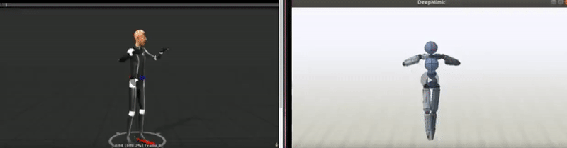

# FbxToMimic

## Goal

The [DeepMimic project](https://github.com/xbpeng/DeepMimic) currently offers no way to import custom reference motions. This is shown in [DeepMimic issue #23](https://github.com/xbpeng/DeepMimic/issues/23). This project aims to transfer animation data from .FBX files into DeepMimic Motion files. Motion files can then be used to Train DeepMimic skills.

## Progress so far




## Dependencies

Python `sudo apt install python`

numpy `pip install numpy`

## Process

- User ensures .fbx files are in desired format
	- "FBX 6.1 ASCII", exported from blender
- User puts desired .fbx files in /InputFbx/
- User manually creates humanoid rig from .fbx bone names
- User calls [FbxToMimic.py](./FbxToMimic.py) to start conversion
	- All files in "/OutputMimic/" are removed
- [FbxToJson.py](./Utils/FbxToJson.py) 
	- removes all files in "/Utils/Temp/"
	- converts .fbx files in "/InputFbx/" to .json files in "/Utils/Temp/"
- [JsonToMimic.py](./Utils/JsonToMimic.py)
	- converts fbx.json files in "/Utils/Temp/" to DeepMimic Motion files in /OutputMimic/

## Prepairing your .fbx files

JsonToMimic.py is not currently able to work with rotation data unless there is a return character after every ",L,".
This means the euler rotation data for animations inside .fbx files must be formatted as shown.


If your files are not formatted as shown above, they can be fixed with [Blender](https://www.blender.org/)
### Fixing your .fbx files with Blender

- Import your file into Blender
- Export as .fbx


- In the bottom left, make sure you export as "FBX 6.1 ASCII"


## Creating a humanoid rig

Currently joints in .fbx files have to be manually assigned by name to the corresponding joints in the Mimic Motion humanoid rig. This is done by assigning .fbx model's bone names to the corresponding joint properties in ./Rigs/humanoidRig.json

I am currently unaware of how to create or use any algorithms that know how to automatically generate a humanoid rig (similar to how unity can), but am open to using them upon finding one.

## Running the project

```Bash
python FbxToMimic.py
```

Will convert all .fbx files located in /InputFbx/ into Mimic Motion files, located in /OutputMimic/
